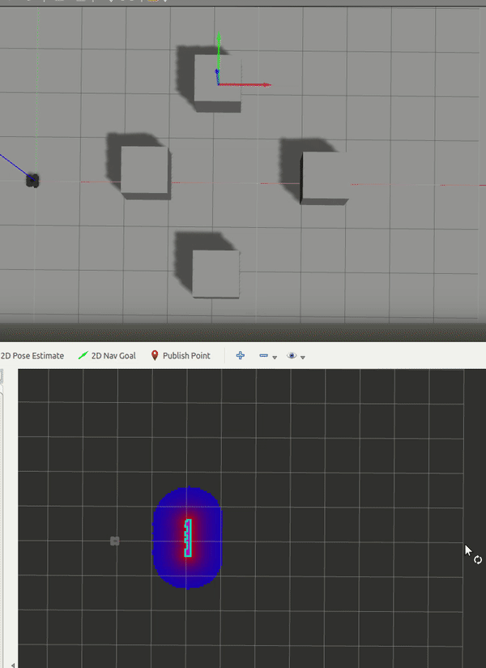

# 1. 简介

基于平面激光雷达传感器, 在未知环境下控制机器人绕过障碍物到达指定目标点

仿真效果:



实际效果:


可执行节点有两个:

- `simple_obstacle_stop_node`: 独立的一个小节点, 通过读取激光雷达扫描数据获得障碍物的距离, 执行减速或停止的控制.

- `obstacle_avoidance_server`: 基于滚动窗口选择子目标点, 以及局部代价地图和动态窗口实现机器人控制的节点, 根据`move_base`的`SimpleActionlibServer`修改而来. 滚动窗口参考文献[1]实现, 具体算法实现在`rolling_window`功能包中.

- `obstacle_avoidance_client`: 向`obstacle_avoidance_server`发布导航目标点, 可以通过txt文件读取, 也可以通过订阅

# 2. 依赖

- [rolling_window](../rolling_window/)
- [navigation_stack](https://github.com/ros-planning/navigation/tree/kinetic-devel)
- [turtlebot3_simulation](https://github.com/ROBOTIS-GIT/turtlebot3_simulations)

# 3. 使用

## 3.1 turtlebot3仿真

首先打开turtlebot3 gazebo, 搭建障碍物环境, 比如放几个方块

```
roslaunch turtlebot3_gazebo turtlebot3_empty_world.launch 
```

启动避障程序:

```
roslaunch obstacle_avoidance turtlebot3_simulation.launch 
```

底盘会自动朝`./param/nav_path.txt`预设的目标点开始导航控制

## 3.2 金智达底盘

按顺序插好串口(GPS: `/dev/ttyUSB0`, 底盘: `/dev/ttyUSB1`, 平面激光雷达: `/dev/ttyACM0`)

打开gpsd服务: 

```
gpsd -S 4000 /dev/ttyUSB0
```

gpsd服务使用波特率嗅探器自动检测串口的波特率, 需要等待一段时间才能成功连接, 可以使用socket工具监听端口4000, 向gpsd服务器发送监听请求:

```json
?WATCH={"enable":true, "json":true}
```

开启手机热点, PC端连接后使用`ifconfig`指令查看本地IP, 连接磁力计程序, **连接之前请校正手机指南针指向正确, 北门是正北方向**. 同时需要修改[current_yaw_node.py](../nav_goal_lh/scripts/current_yaw_node.py#L12)的IP

启动所有传感器节点:

```
roslaunch neurobot_bringup neurobot_sensor_bringup.launch
```

启动launch文件后需要确认`/fix`, `/odom`, `/yaw_odom`, 是否都有数据

启动ekf节点:

```
roslaunch robot_pose_ekf.launch neurobot_ekf.launch play_bag:=false
```
默认`neurobot_data_proprocess`是开启debug的, 如果初始化没有数据出来, 说明message_filter没有同步程序, 重启传感器launch文件, 手机磁力计连接需要断开重启, gpsd不需要. 如果还不行就重启电脑

等待ekf节点成功定位后, 启动避障程序:

```
roslaunch obstacle_avoidance turtlebot3_simulation.launch 
```

底盘会自动朝`./param/nav_path.txt`预设的目标点开始导航控制

# 4. 存在问题

- [Half DONE] `rolling_window`部分情况的振荡问题, 出现的情况包括但不限于: 障碍物尺寸过大扫描不完整, 凹状障碍物..

- [HALF DONE] 避障过程中离障碍物还是有点近, 现在当发现可以达到全局目标时加了一个延迟, 效果稍微好一点了.

# 5. 参考文献

[1] 胡远航. 未知环境下自主移动机器人避障研究[D].哈尔滨工程大学,2013.